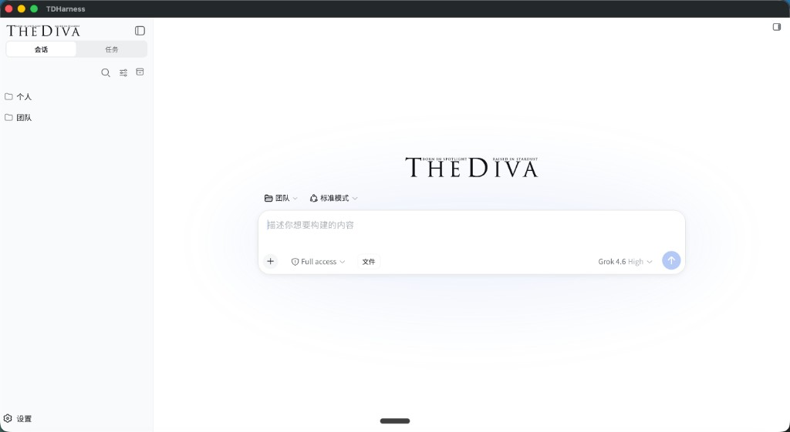
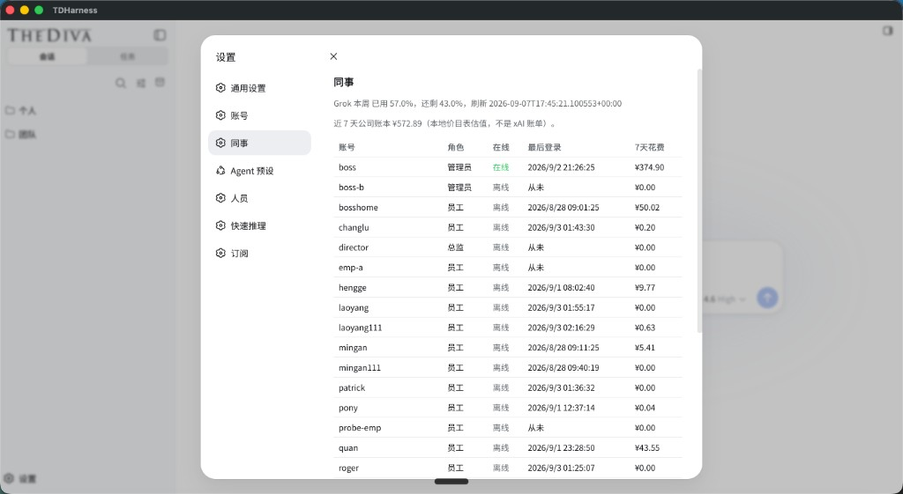
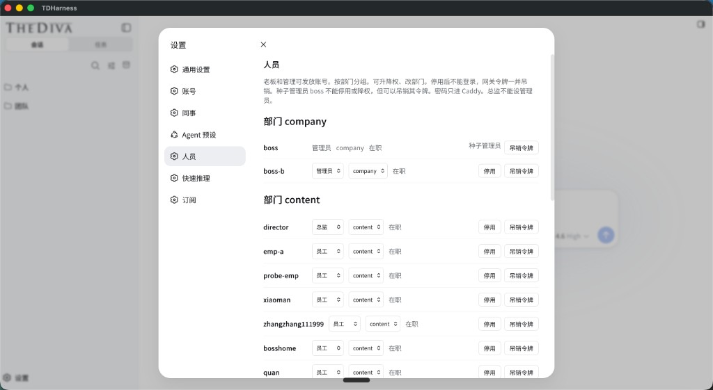
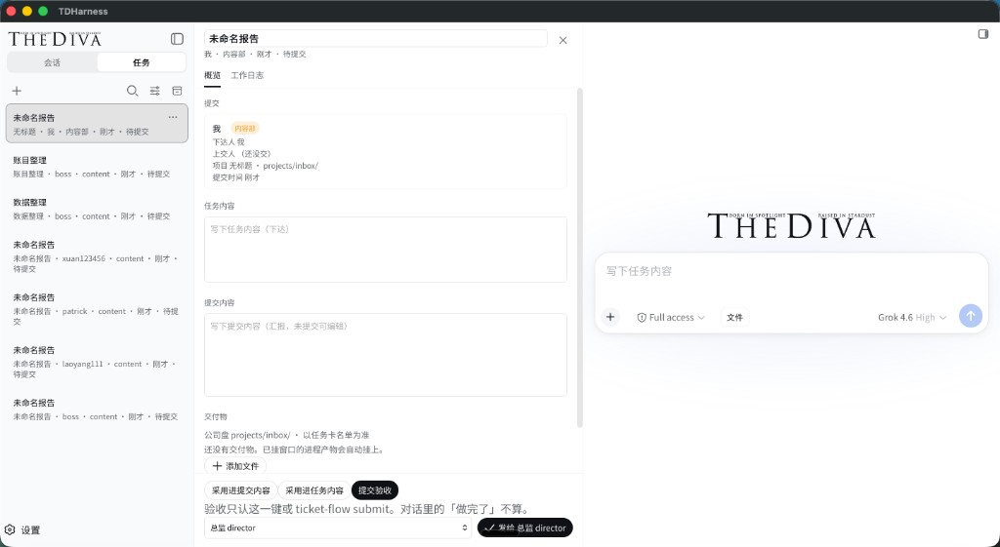

# TDHarness-coding

**Get running in five minutes.** Whether this is the product you want is in **[docs/PRODUCT.md](docs/PRODUCT.md)** (coding edition: usable, not mature). Bugs: [BUGS.md](BUGS.md).

中文增页（不替代上文）：[项目讲解](docs/BRIEF.zh.md) · [寻找共建者](docs/WANTED.zh.md)

## You need

- Node 22+
- Your own DeepSeek (or OpenAI-compatible) API key
- A **local** folder as the workspace (not UNC / a network drive)

## Install

```bash
git clone https://github.com/398894496-arch/TDHarness-coding.git
cd TDHarness-coding
bash scripts/setup.sh
export PATH="$HOME/.tdh-coding-prefix/bin:$PATH"
export DEEPSEEK_API_KEY='your-key'
dsh --patch "$PWD/overlays/solo.yml"
```

Windows: `pwsh -File scripts/setup.ps1`. Setup installs `@deepseek-ai/dsh@0.1.1-rc.2` into `~/.tdh-coding-prefix` and applies patches. Do not point it at a live `node_modules`.

Green: `bash scripts/prove-scan.sh` → `SCAN_OK=1`. After setup: `node scripts/prove-patches.js` → `PATCH_PROVE_OK=1`.

## What the running desk does

This clone is the **kernel patch tree**. The shots below are the **company delivery desk** that sits on those patches (chat, tickets, roster, spend). `setup.sh` does not install that shell. Feature write-up: [docs/PRODUCT.md](docs/PRODUCT.md#what-the-running-desk-does). 中文功能：[docs/PRODUCT.zh.md](docs/PRODUCT.zh.md).

| Session | Colleagues |
| --- | --- |
|  |  |
| **Personnel** | **Tasks** |
|  |  |

- **Session:** 会话 / 任务, 个人 and 团队 workspaces, model picker, Full access, files.
- **Colleagues:** who is online, role, last login, 7-day local cost estimate (not the vendor bill).
- **Personnel:** department, promote/demote, deactivate, revoke gateway token. Seed admin cannot be deactivated.
- **Tasks:** ticket with 概览 / 工作日志, deliverables on the company disk, **提交验收** (saying “done” in chat does not count).

## Open work

Not a wishlist. Each id in **[BUGS.md](BUGS.md)** has files, a green line, and the skill it needs:

| Id | Hole |
| --- | --- |
| C1 | Path-check tests (today we grep patch marks) |
| C2 | Mapped `Z:\` / SUBST still looks local |
| C3 | Review `trustedHost` on custom skills and DACL skip on `ACCESS_DENIED` |
| C4 | `setup` still pins company `__DESK_SKILLS__` onto official presets |
| C5 | Dry-run the next `dsh` tag until an anchor breaks |
| C6 | Secret scan beyond office IP needles |
| C7 | Windows `mklink` prove, not a string match |
| C8 | rg “missing root → no matches” may swallow real IO errors |

Fork + PR. Open a **Task** issue with the id first. [CONTRIBUTING.md](CONTRIBUTING.md). Same list in Chinese: [寻找共建者](docs/WANTED.zh.md). Upstream door (no PRs): [docs/UPSTREAM.md](docs/UPSTREAM.md).
