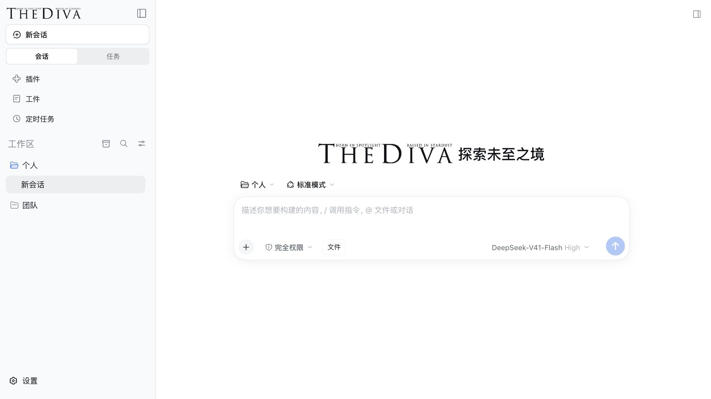
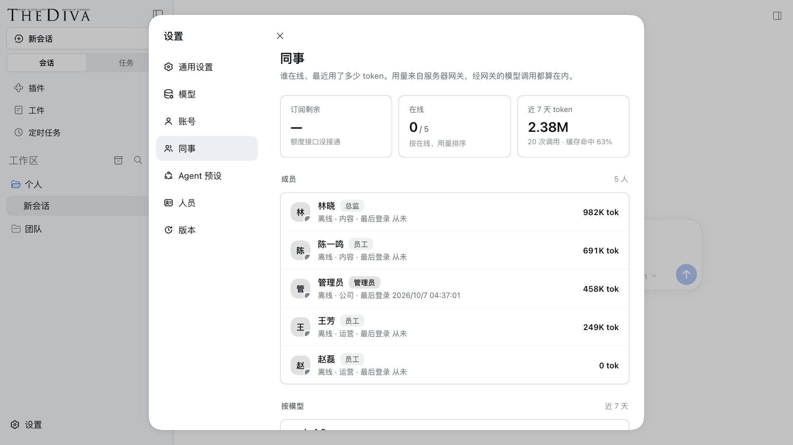
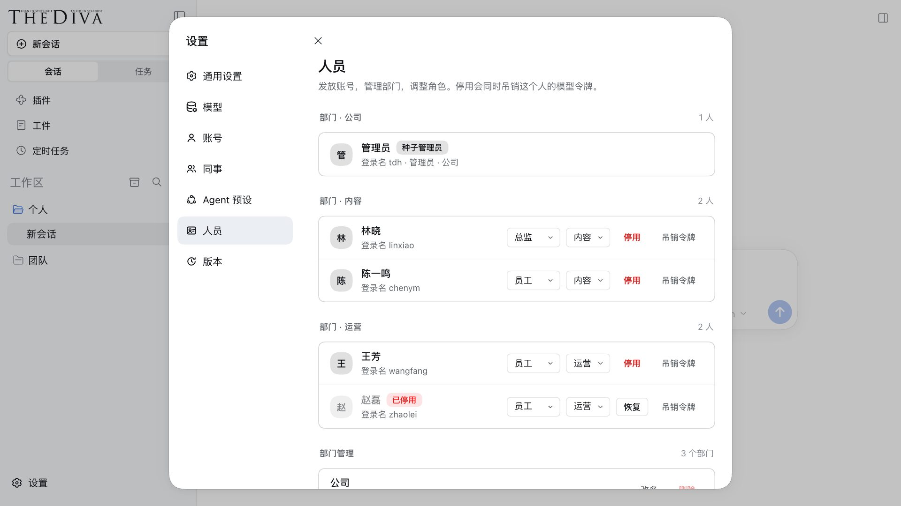
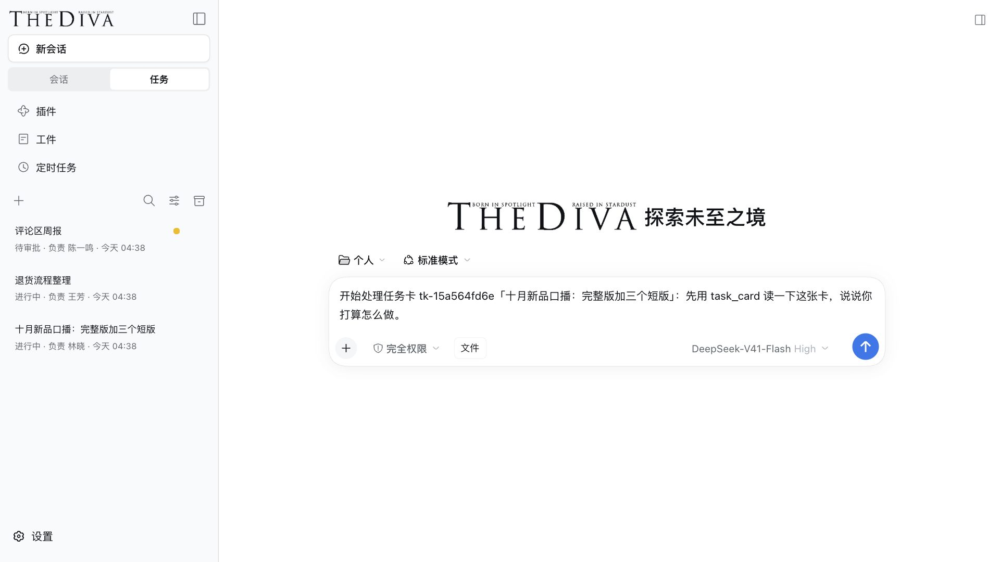

# TDHarness-coding

**A Windows machine can clone this repo and stand up a full TDH server.** That is the product path. Kernel-only coding setup is still below for people who only want the patched `dsh` CLI.

Whether the coding edition is what you want: **[docs/PRODUCT.md](docs/PRODUCT.md)**. Server install: **[docs/SERVER.md](docs/SERVER.md)**. Bugs: [BUGS.md](BUGS.md).

中文增页（不替代上文）：[项目讲解](docs/BRIEF.zh.md) · [寻找共建者](docs/WANTED.zh.md)

## Install a TDH server (Windows)

Needs Administrator, Python 3, Node 22+, Git LFS.

```powershell
git clone https://github.com/398894496-arch/TDHarness-coding.git
cd TDHarness-coding
git lfs pull
pwsh -File scripts\setup-all.ps1
```

Green: `SITE_INSTALL_OK=1`, `LOGIN_PROVE_OK=1`, `GUI_PROVE_OK=1`, `PLANT_CLIENT_OK=1`. Setup logs in as `tdh` / `12345678`, compiles `TDHarness.exe` for this LAN, writes `/client/version.json`, and plants the desktop shortcut. Open that shortcut and use the same account. Put your own model key in `D:\dsh\runtime\gateway.env`, then restart task `Autostart-Gateway`.

This repo does **not** contain company documents, brain text, subscription keys, Tailscale auth, or an office roster. Those are local to whoever runs setup.

## Kernel-only (optional)

- Node 22+
- Your own DeepSeek (or OpenAI-compatible) API key
- A **local** folder as the workspace (not UNC / a network drive)

```bash
git clone https://github.com/398894496-arch/TDHarness-coding.git
cd TDHarness-coding
bash scripts/setup.sh
export PATH="$HOME/.tdh-coding-prefix/bin:$PATH"
export DEEPSEEK_API_KEY='your-key'
dsh --patch "$PWD/overlays/solo.yml"
```

Windows kernel: `pwsh -File scripts/setup.ps1`. This installs `@deepseek-ai/dsh` from `kernel.yml` into `~/.tdh-coding-prefix` and applies the coding patch subset. It does **not** start 8443 / 8450 / knowledge. Do not point it at a live `node_modules`. The company pins stay off unless `TDH_FULL_PATCHES=1`.

Green: `bash scripts/prove-scan.sh` → `SCAN_OK=1`. After setup: `node scripts/prove-patches.js` → `PATCH_PROVE_OK=1`. Local ChatGPT / Grok / Claude login and custom endpoints: [docs/MODELS.md](docs/MODELS.md) (`node scripts/prove-models.js` → `MODELS_PROVE_OK=1`).

## What the running desk does

This clone is the **kernel patch tree**. The shots below are the **company delivery desk** that sits on those patches (chat, tickets, roster, spend). `setup.sh` does not install that shell. Feature write-up: [docs/PRODUCT.md](docs/PRODUCT.md#what-the-running-desk-does). 中文功能：[docs/PRODUCT.zh.md](docs/PRODUCT.zh.md).

| Session | Colleagues |
| --- | --- |
|  |  |
| **Personnel** | **Tasks** |
|  |  |

- **Session:** 会话 / 任务, 个人 and 团队 workspaces, model picker, Full access, files.
- **Colleagues:** who is online, role, last login, 7-day local cost estimate (not the vendor bill).
- **Personnel:** department, promote/demote, deactivate, revoke gateway token. Seed admin cannot be deactivated.
- **Tasks:** ticket with 概览 / 工作日志, deliverables on the company disk, **提交验收** (saying “done” in chat does not count).

## Open work

C1–C9 are closed in **[BUGS.md](BUGS.md)** (sandbox, secrets, junctions, search errors, local model login). Pick a remaining hole from that file, or file a Bug.

Fork + PR. Open a **Task** issue with the id first. [CONTRIBUTING.md](CONTRIBUTING.md). Same list in Chinese: [寻找共建者](docs/WANTED.zh.md). Upstream door (no PRs): [docs/UPSTREAM.md](docs/UPSTREAM.md).
