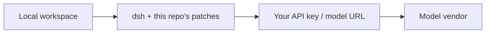

# TDHarness-coding

A **coding edition** of a DeepSeek Harness patch tree. **Usable, not a mature product.** Not an employee installer and not hosted SaaS.

Install lives only in [README](../README.md) (run it in five minutes). This page answers: **is this what you want?**

| Is | Is not |
| --- | --- |
| Official `@deepseek-ai/dsh` plus the kernel patches in this repo | A finished client, an SLA, or sign-in-and-go |
| A **local** folder as the workspace, and **your** model API key | Company roster, private tailnet, per-seat quotas, office gateway |
| Issues and PRs **here** | Upstream accepting PRs (they do not, for now) |
| Known holes in [BUGS.md](../BUGS.md) | The company delivery workbench (tickets, company share, search door) |

Traffic does not go through a company gateway. Keys and bills stay between you and the vendor.

---

## What the running desk does

Added here so the page names the product, not only the patches. **These screenshots are the company delivery desk.** Cloning this repo and running `setup.sh` does not give you login, roster, tickets, or spend. That shell is private ops. This repo is the patch layer that desk runs on.

中文同一套说明：[PRODUCT.zh.md](PRODUCT.zh.md).

### Session

Two tabs: **会话** (chat) and **任务** (tickets). Sidebar splits **个人** and **团队** folders. The prompt is “describe what you want to build.” Attachments, **Full access** (sandbox preset), **文件**, and a model picker (here Grok 4.6 High) sit on the composer. Settings is the gear at the bottom of the sidebar.

### Colleagues

Settings → **同事**. Weekly model quota, a **7-day company ledger** using a **local price list** (explicitly not the vendor invoice), per-account role (admin / director / employee), online, last login, 7-day spend.

### Personnel

Settings → **人员**. Accounts grouped by department. Boss and managers issue accounts. You can change role and department, **停用**, and **吊销令牌**. The seed administrator cannot be deactivated.

### Tasks

**任务** is a ticket, not a chat log. Overview vs 工作日志. Content / submission fields. Deliverables live on the company disk (`projects/inbox/` in the shot). **提交验收** is the only accept path; saying “done” in chat does not count. Route to a director for review.

---

## Who it is for

People who can use git and Node, pin a `dsh` version, read a patch failure, and send a PR.

A separate **company delivery** product exists for ~20–100 person firms with a roster and a company disk. That product does not install for a handful of people with no LAN and no roster. **This repo is the opposite:** a handful of people who *can* clone. Do not mix the two.

Not for: Setup.exe / DMG login, SLA, chat-only, or cloning a company share and roster.

## What it is

A patch tree on [DeepSeek Harness](https://github.com/deepseek-ai/deepseek-harness) (MIT) plus `overlays/solo.yml`.

The agent runs **on your machine** and can touch files and commands you can already touch. One line: **you fork the harness; output stays on your disk; bugs are listed; PRs land here.** This is not on-site delivery of a job-shaped workbench.

Upstream does not take external PRs; GitHub Issues there are closed. Product PRs stay in this repo. Kernel bugs that reproduce on stock `dsh` with no overlay can also go to [upstream Discussions](https://github.com/deepseek-ai/deepseek-harness/discussions) with a link back.

## What the patches actually buy (for someone deciding whether to put this on a work PC)

This is **not** “the agent is sandboxed, so you are safe.” The agent still has **your user permissions on that machine**. These patches turn official false-greens and hard crashes on Windows shares / read-only app copies into an explicit refuse or a boot that works.

| What the patch does | Without it | How to read it |
| --- | --- | --- |
| Refuse a **UNC / network** path as the sandbox workspace | Windows cannot plant an NTFS ACL on a network volume. `workspace-write` looks on and either confines nothing or the grant fails | **Not** “block escape onto the share.” It **forbids fake confinement**. Put the workspace on a local disk. If you use a share, let **server** ACLs own it |
| Windows `mklink /J` with cmd cwd pinned to the system drive | Official `symlink` hits EPERM without Developer Mode; if cwd is `\\server\share`, cmd cannot use UNC and the desk dies (`win-junction-failed`) | Staff do not need Developer Mode to boot. This does **not** mean the agent cannot touch network paths |
| Skip copying ACLs on SMB writes; publish sessions with `rename` instead of hard links | `ReplaceFileW` / `fs.link` fail on the share and the edit or new session aborts | Writes can finish. “This volume does not support that NTFS op” is not a model error |
| Missing search roots become “no matches” instead of a hard fail | A broken junction makes `rg` kill the turn | A bad path does not kill the whole round |
| macOS: refuse an App Translocation read-only copy | Opening a `.app` from Downloads/DMG and writing into the bundle hits `EROFS` | This edition is CLI-first and does not ship a DMG; drop the check into your own launcher if you pack an app |

After you bump official `dsh`, re-apply patches. A missing anchor is a hard fail. That is the upgrade gate.

## Versus other options

| Question | Stock dsh | Hand out a vendor key | This repo | Company delivery workbench |
| --- | --- | --- | --- | --- |
| Time to first run | npm | Fastest | clone + patch + your key | Network + host + roster |
| Where data lives | Whatever folder you set | Scattered | Your local folder | The customer’s company disk |
| Patching / PRs | No external PRs | None | This repo | Private ops, not on GitHub |
| Per-person kill switch | No | No | No | Yes |
| Maturity | Developer preview | — | **Called out as immature** | In use internally; onboarding still has holes |

If you need “everyone in chat on AI next week,” do not use this repo.

## Safety, stated plainly

Done here: the tree is scanned for office IPs and keys; the patcher refuses well-known live prefixes; a network workspace is not allowed as the sandbox root.

You still need to know: the agent cannot police you; this repo does not see your key or bill; there is no per-person disk isolation and no one-click revoke.

## What it will not do

No Setup.exe / DMG. No publishing the ops tree. No promise to track upstream releases. Write access to `main` is fork + PR unless you are added as a collaborator.

---

**Next:** run it → [README](../README.md). Claimable holes → [BUGS.md](../BUGS.md). How to patch → [HACKING.md](HACKING.md). Contribute → [CONTRIBUTING.md](../CONTRIBUTING.md). License and rename → [NOTICE.md](../NOTICE.md).
