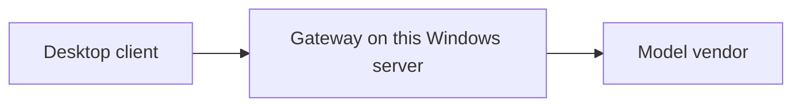

# TDHarness-coding

**Delivery is a one-click install.** The server: clone, then one command (`scripts/setup-all.ps1`). Employees: open the server's download page and run `TDHarness-Setup.exe` on Windows, or unzip the app on a Mac. Employees never touch a patch, Node or a command line; the server needs Git (with LFS), Node 22+ and Python 3 installed, then that one command as Administrator. 中文：交付就是一键安装——服务器一条命令装完，员工在下载页点一下装客户端。

The product is the Windows LAN server and its desks. The kernel-only CLI path is optional. Install steps live in [README](../README.md#delivery-is-a-one-click-install--交付就是一键安装). This page answers: **is this what you want?**

| Is | Is not |
| --- | --- |
| Windows server: clone, then one command, `scripts/setup-all.ps1`, stands up login, a seed admin, the gateway, the knowledge base and the desktop clients on that LAN. Employees install from the server's download page | Hosted SaaS, a client that phones a vendor cloud for your files, or a generic installer on the Releases page (each site's installer is compiled by setup for that server) |
| Model keys and subscriptions added on the server after install (Settings → 模型 writes `gateway.env`); every desk lists what the server can reach | Keys on employee machines, or subscription keys, company documents, or a live roster shipped in git |
| Optional kernel-only: a local folder plus your own key ([MODELS.md](MODELS.md)) | The kernel-only path pretending to be the full server |
| Issues and PRs **here** | Upstream accepting PRs (they do not, for now) |

```mermaid
flowchart LR
  C[Desktop client] --> G[Gateway on this Windows server]
  G --> V[Model vendor]
```

The Windows server sends model traffic through the gateway installed on that machine, which routes each model to its vendor (OpenAI, Anthropic, DeepSeek, xAI / Grok subscription, Kimi, GLM, or any OpenAI-compatible endpoint). Keys stay in `gateway.env` on that PC, not in git and not on the desks. See [SERVER.md](SERVER.md#models-keys-stay-on-this-machine). The kernel-only CLI ([MODELS.md](MODELS.md)) is separate: it writes `$DSH_HOME/.credentials.yaml` and does not start the gateway.

---

## What the running desk does

These screenshots are the desk `setup-all.ps1` installs. `setup.sh` is only the kernel path and does not start login or the gateway.

中文同一套说明：[PRODUCT.zh.md](PRODUCT.zh.md).

### Session

Two tabs: **会话** (chat) and **任务** (tickets). Sidebar splits **个人** and **团队** folders. The prompt is “describe what you want to build.” Attachments, **Full access** (sandbox preset), **文件**, and a model picker (here Grok 4.6 High) sit on the composer. Settings is the gear at the bottom of the sidebar.

### Colleagues

Settings → **同事**. Weekly model quota, a **7-day company ledger** using a **local price list** (explicitly not the vendor invoice), per-account role (admin / director / employee), online, last login, 7-day spend.

### Personnel

Settings → **人员**. Accounts grouped by department. Boss and managers issue accounts. You can change role and department, **强制重新登录** (forces a fresh sign-in), **停用** (no sign-in, every gateway door and the person's own share account closed on the next request), and, once deactivated, **删除** (off the roster, password gone, login retired; the personal folder stays on the company share). The seed administrator cannot be deactivated or removed.

### Tasks

**任务** is a ticket, not a chat log. Overview vs 工作日志. Content / submission fields. Deliverables live on the company disk (`projects/inbox/` in the shot). **提交验收** is the only accept path; saying “done” in chat does not count. Route to a director for review.

### Also running

- **Knowledge base:** a nightly job distils each person's conversations of the day into a page the desk can search.
- **Web search:** domestic engines first for Chinese, Exa, GitHub, Bilibili; `深搜 ` for Grok's sourced web search.
- **Browser:** OpenCLI ships with the Windows client; the agent guides each person through loading its extension once.
- **Long work:** automatic context compaction at 80% of the model's window, and on a too-long prompt.
- **Talking-head editing (optional):** recording in, Jianying draft out (`server/koubo`).

---

## Who it is for

A company on one LAN with a roster and a company share: one Windows PC that stays on as the server, employees on Windows or Mac. Running it takes the one setup command on the server and nothing on the desks beyond the installer. Sizing and what must be in place (about 20–100 people, a maintained roster, a server with 32 GB): [BRIEF.zh.md](BRIEF.zh.md).

Changing it is a different job: that takes git and Node, reading a patch failure, and a PR here ([CONTRIBUTING.md](../CONTRIBUTING.md)).

Not for: hosted SaaS, an SLA, chat-only use, or a team with no LAN and no roster.

## How it is built

The **source** is a patch tree on [DeepSeek Harness](https://github.com/deepseek-ai/deepseek-harness) (MIT): [kernel.yml](../kernel.yml) pins the upstream `@deepseek-ai/dsh` release, setup installs it from npm, then applies this repo's anchored kernel patches (`patches/`) and client site patches (`server/site-patches/`). There is no copied fork of upstream, so moving to a new upstream release is: change the pin, re-apply, and any anchor that no longer matches fails hard. That is how the code is kept, not how it is delivered. Delivery is the one-click install above.

The agent runs **on the employee's machine** and can touch the files and commands that person can already touch.

Upstream does not take external PRs; GitHub Issues there are closed. Product PRs stay in this repo. Kernel bugs that reproduce on stock `dsh` with no overlay can also go to [upstream Discussions](https://github.com/deepseek-ai/deepseek-harness/discussions) with a link back.

## What the patches actually buy (for someone deciding whether to put this on a work PC)

This is **not** “the agent is sandboxed, so you are safe.” The agent still has **your user permissions on that machine**. These patches turn official false-greens and hard crashes on Windows shares / read-only app copies into an explicit refuse or a boot that works.

| What the patch does | Without it | How to read it |
| --- | --- | --- |
| Refuse a **UNC / network** path as the sandbox workspace | Windows cannot plant an NTFS ACL on a network volume. `workspace-write` looks on and either confines nothing or the grant fails | **Not** “block escape onto the share.” It **forbids fake confinement**. Put the workspace on a local disk. If you use a share, let **server** ACLs own it |
| Windows `mklink /J` with cmd cwd pinned to the system drive | Official `symlink` hits EPERM without Developer Mode; if cwd is `\\server\share`, cmd cannot use UNC and the desk dies (`win-junction-failed`) | Staff do not need Developer Mode to boot. This does **not** mean the agent cannot touch network paths |
| Skip copying ACLs on SMB writes; publish sessions with `rename` instead of hard links | `ReplaceFileW` / `fs.link` fail on the share and the edit or new session aborts | Writes can finish. “This volume does not support that NTFS op” is not a model error |
| Missing search roots become “no matches” instead of a hard fail | A broken junction makes `rg` kill the turn | A bad path does not kill the whole round |
| macOS: refuse an App Translocation read-only copy | Opening a `.app` from Downloads/DMG and writing into the bundle hits `EROFS` | The Mac desk ships as a zip, not a DMG; the download page says to move it to Applications before opening |

After you bump official `dsh`, re-apply patches. A missing anchor is a hard fail. That is the upgrade gate.

## Versus other options

| Question | Stock dsh | Hand out a vendor key | This repo |
| --- | --- | --- | --- |
| Time to first run | npm | Fastest | One setup command on the server; one installer per desk from the download page |
| Where data lives | Whatever folder you set | Scattered | The company share on your server |
| Keys | On each machine | On each machine | Only on the server; desks hold a per-person login token |
| Patching / PRs | No external PRs | None | This repo |
| Per-person kill switch | No | No | Yes: deactivate the person in 人员 and models, web search, image/video generation and the knowledge base stop on the next request; remove the account afterwards to take it off the roster for good |
| Maturity | Developer preview | — | **Called out as immature** |

If you need “everyone in chat on AI next week,” do not use this repo.

## Safety, stated plainly

Done here: the tree is scanned for office IPs and keys; the patcher refuses well-known live prefixes; a network workspace is not allowed as the sandbox root; desks reach the model gateway over TLS (8443/gw, pinned to this server's own root), it answers only a live per-person login token and trusts no address, only an admin's token can change keys, and its page reader refuses private addresses ([SERVER.md](SERVER.md#who-the-gateway-answers)).

You still need to know: the agent cannot police you; this repo does not see your key or bill; there is no per-person disk isolation; everyone on the roster can search the whole knowledge base; the seed admin `tdh` / `12345678` must be changed right after install (Settings → 账号 → 修改密码).

## What it will not do

No generic Setup.exe / DMG on the Releases page: setup compiles each site's installer with that server's address and update-signing key. No publishing the ops tree. No promise to track upstream releases. Write access to `main` is fork + PR unless you are added as a collaborator.

---

**Next:** run it → [README](../README.md). Claimable holes → [BUGS.md](../BUGS.md). How to patch → [HACKING.md](HACKING.md). Contribute → [CONTRIBUTING.md](../CONTRIBUTING.md). License and rename → [NOTICE.md](../NOTICE.md).
